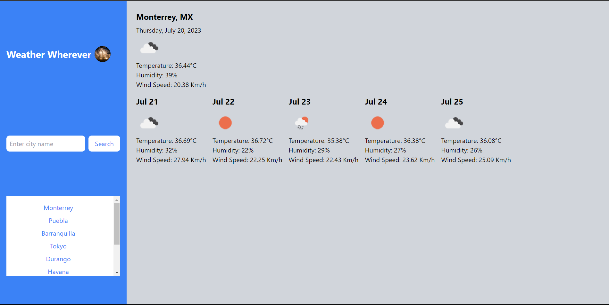

# Weather Wherever

Weather Wherever is a web application that allows users to search for weather information of any city around the world. It provides real-time weather data, including the current weather conditions and a 5-day forecast. The application also maintains a history of previously searched cities for quick access.

- [Features](#features)
- [Getting Started](#getting-started)
- [Dependencies](#dependencies)
- [APIs Used](#apis-used)
- [Credits](#credits)
- [Contribution](#contribution)
- [License](#license)
- [Deployed](#deployed)

## Features

- Real-time Weather Data: The application fetches weather data from the OpenWeatherMap API and displays the current weather conditions for the searched city.

- 5-Day Forecast: Along with the current weather, the application also provides a 5-day forecast, showing weather details for each day.

- Search History: Weather Wherever keeps track of previously searched cities and displays them as buttons in the sidebar. Users can click on these buttons to quickly fetch weather data for a previously searched city.

- Local Storage: The application stores the search history in the browser's local storage, so the history persists even if the page is reloaded or closed.

- Limit on Search History: To prevent the search history from growing indefinitely, the application limits the number of cities displayed in the search history to 10. The oldest searched city is removed from the list when a new city is added.

## Getting Started

To use the Weather Wherever application, simply follow these steps:

1. Clone the repository or download the source code to your local machine.

2. Open the `index.html` file in your web browser. The application should load, and you can start searching for weather information by entering a city name in the search bar and clicking the "Search" button.

3. The current weather and forecast for the searched city will be displayed in the main content area.

4. The sidebar will show a list of previously searched cities. Clicking on any city button will fetch and display the weather information for that city.

## Dependencies

The Weather Wherever application relies on the following dependencies:

- Tailwind CSS: The application uses Tailwind CSS for styling. The CSS framework is loaded from the CDN in the HTML file.

## APIs Used

The application utilizes the OpenWeatherMap API to fetch weather data. The API key used for this purpose is stored in the `script.js` file.

## Contribution

Contributions to Weather Wherever are welcome! If you find any issues or have suggestions for improvement, feel free to create a pull request or open an issue.

## License

Weather Wherever is released under the MIT License. You can find the full license in the `LICENSE` file.

## Credits

Weather Wherever was developed by Didier Thomas as part of a project or learning exercise.

## Deployed

